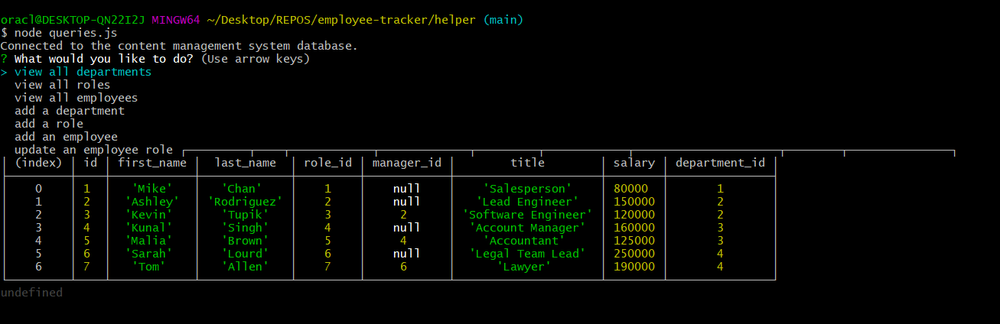

# Employee Tracker
This is a repository for an employee-tracker application. It is meant to serve as a way to manage a database with tables that contain information about a company such as departments, employees, employee relations, and employee details such as salary and and job-title.

# Installation
Files can be downloaded from this GitHub repository. Once downloaded, the application can be used by running queries.js inside of a node terminal.

# Usage
Run queries.js inside of a node terminal and follow the on screen instructions. 
 
 https://watch.screencastify.com/v/kyWnNo2XFrBVQ6ez5IoH

# License
MIT